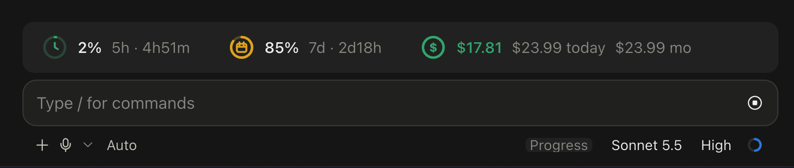

# usage-bar

A Claude Code [mod](https://claude.com/blog/claude-code-mods) that draws a usage card above the prompt.



```
(clock ring) 14%  5h · 1h7m    (calendar ring) 83%  7d · 2d18h    ($ ring) $8.58  $14.76 today  $14.76 mo
```

- **5h / 7d** are your rate-limit windows. The ring fills with the share used and turns amber from 70% and red from 90%. The text after the dot is the time left until the window resets.
- **$ amounts** are this session's cost, then today's and this month's total across all your sessions.
- The card adapts to its width: when narrow it drops `mo`, then `today`, then the cost group.
- The card's frame and padding come from the desktop app. The ring icons need the desktop app; in the terminal the same numbers are drawn as plain text.
- Rate-limit windows exist only on subscription plans. With an API key there is no 5h/7d data, and those two groups stay at `--`.
- Right after a new session starts, the 5h/7d numbers are the ones from the last session, until the first reply brings fresh ones. A window whose reset time has passed is dropped.
- If another mod also draws above the prompt (for example a progress bar), its content is stacked under the card.

## Install

In Claude Code (CLI or desktop app):

```
/plugin marketplace add LuLuPig-King/usage-bar
/plugin install usage-bar@lulu-mods
/reload-plugins
```

If the card does not show up, restart Claude Code. Requires Claude Code 2.1.287 or later, the version the [official mods guide](https://claude.dev/blog/getting-started-with-claude-code-mods/) asks for.

## What it reads and writes

Mods are not sandboxed, so here is everything this one does:

- Reads the session's usage and cost from Claude Code (`$.session.usage()`), refreshed after each turn and once a minute so the countdown moves.
- Stores two things in its own key-value store (`$.store`, a JSON file under your Claude Code configuration directory): the cost ledger (per-day totals and a per-session baseline, sessions older than 40 days are pruned) and the last-seen rate-limit windows.
- No network access, no shell commands, no file access outside its own store.

"Today" and "month" start counting from the day you install it, and follow your computer's local time.

## License

MIT
